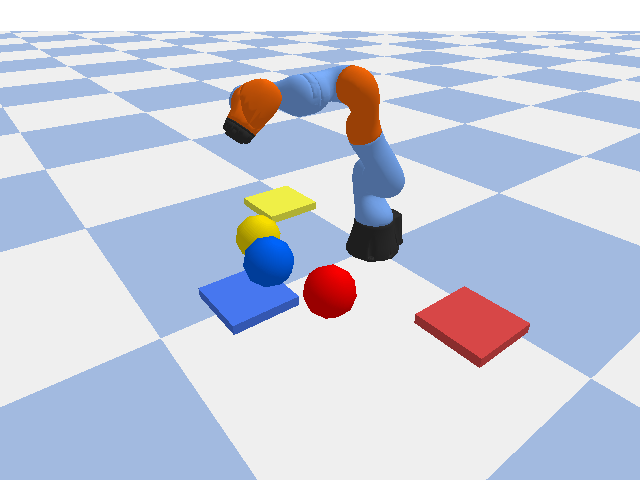

# UR Color Sorter

URロボットアームがカメラで色を認識し、色別に物体を仕分けるシミュレーション。

## 概要

| 項目 | 内容 |
|------|------|
| シミュレーター | PyBullet（物理エンジン） |
| 色認識 | OpenCV（カメラ画像処理） |
| 学習フレームワーク | Stable-Baselines3 + Gymnasium |
| 最終目標 | 強化学習による自動仕分けの習得 |

## フェーズ計画

### Phase 1 — 環境構築
- PyBullet上にURロボットアームを配置
- カメラ視点の設定

### Phase 2 — 色認識
- OpenCVで物体の色を認識
- 色ラベルの付与（赤・青・緑など）

### Phase 3 — ルールベース仕分け
- 色に応じたピック＆プレース動作を実装
- 動作の安定化・検証

### Phase 4 — 強化学習
- Gymnasium で環境をラップ
- Stable-Baselines3（PPO等）で仕分けポリシーを学習
- 報酬設計・学習曲線の可視化

## 技術スタック

- Python 3.12
- PyBullet — 物理シミュレーション
- OpenCV — 画像処理・色認識
- NumPy — 数値計算
- Gymnasium — RL環境インターフェース
- Stable-Baselines3 — 強化学習アルゴリズム

## デモ



## 実行結果

- Phase1: PyBullet物理シミュレーション動作確認 ✅
- Phase2: OpenCVによる赤・青・黄の色認識 ✅
- Phase3: ルールベースのピック＆プレース ✅
- Phase4: 強化学習による精度改善 ✅ 完了（成功率70%）

## セットアップ

```bash
cd dev/ur-color-sorter
python -m venv venv
source venv/bin/activate
pip install -r requirements.txt
```
